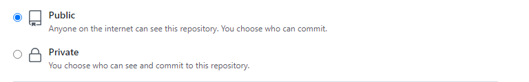
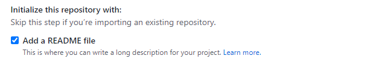
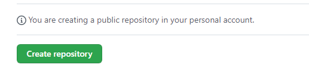
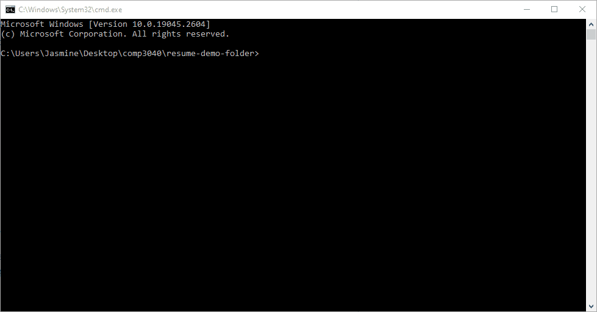
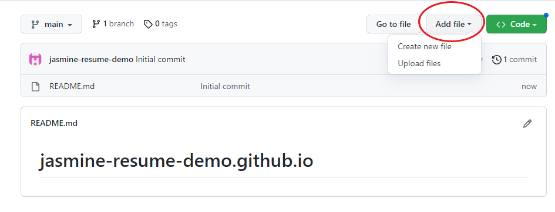
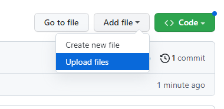
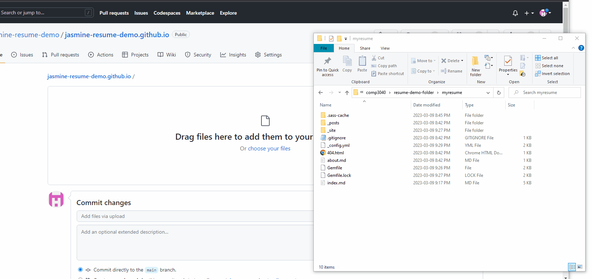
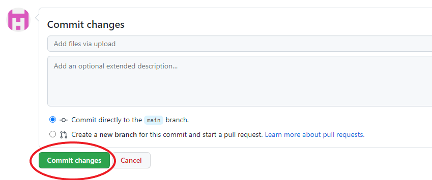
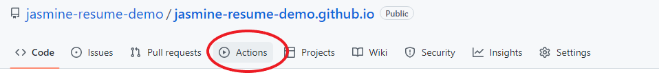

# How to Host a Resume on GitHub Pages using VSCode and Jekyll

## Purpose
The purpose of this guide is to teach you how to host a resume on GitHub Pages using Visual Studio Code and Jekyll.     
Additionally, this guide will teach you some of Andrew Etter's key principals in technical communication, namely:      

1. Use a lightweight markup language
2. Format a document with a static site generator
3. Share/host documents on a distributed version control system

This guide is intended for Windows users. Additionally, this guide assumes you have no experience with Markdown, git, GitHub, or the command line. As such, git commands from the command line will not be used in this guide. If you would like to learn how to use git commands from the command line, check out the [More Resources](https://github.com/jasmine-tabuzo/jasmine-tabuzo.github.io#more-resources) section of this guide.

## Prerequisites
- A [GitHub](https://github.com/) account 
    - Microsoft provides a great tutorial on [creating a GitHub account](https://learn.microsoft.com/en-us/visualstudio/version-control/git-create-github-account?view=vs-2022).
- A resume in Markdown 
    - You can find a Markdown tutorial in the [More Resources](https://github.com/jasmine-tabuzo/jasmine-tabuzo.github.io#more-resources) section of this guide.
- [Visual Studio Code](https://code.visualstudio.com/)
- [Ruby](https://www.ruby-lang.org/en/downloads/) version 2.5.0 or higher, [RubyGems](https://rubygems.org/pages/download), [GCC](https://gcc.gnu.org/install/) and [Make](https://www.gnu.org/software/make/)
    - If you do not already have these installed, you can follow the first two steps of this [Jekyll guide](https://jekyllrb.com/docs/installation/windows/). 
    - I recommend using the `Ruby+Devkit 3.1.3-1 (x64)` version because this version was used to create the resume demo. 

## Instructions

> Throughout this section, I will refer to Andrew Etter's book, *Modern Technical Writing: An Introduction to Software Documentation* to describe some key principals in technical communication. 
> 
> A link to Etter's book can be found in the [More Resources](https://github.com/jasmine-tabuzo/jasmine-tabuzo.github.io#more-resources) section of this guide.

### 1. Create your GitHub repository

> *Etter's Key Principal: Share/host documents on a distributed version control system* 
> 
> We will be using GitHub in this guide because it is a distributed version control system (DVCS). As Etter states, a DVCS has better performance than a centralized version control system, allows for offline work, and is great for doing concurrent work on the same files. This means that you can work on your resume on multiple computers by [creating local copies of your repository](https://docs.github.com/en/repositories/creating-and-managing-repositories/cloning-a-repository). This is a great feature to have if you need to quickly edit your resume on a different computer before a potential employer sees it. Etter also suggests to add a README.md in the root of your repository to store documentation. This is so that your documentation and code can stay in sync. This will be helpful if you ever want others to contribute to your website as well.  

1. Login to your account on GitHub 
2. Select the **+** dropdown in the navigation bar        
    
2. Select **New Repository**         
    
3. Set the repository name to `<your GitHub username>.github.io`        
    
4. Select `Public`    
    
5. Check the box for `Add a README file`     
    
6. Select `Create repository`     
    

### 2. Create a Jekyll Site

> *Etter's Key Principle: Format a document with a static site generator*    
> 
>  We will be using Jekyll to generate the site that hosts your resume. Jekyll is a static site generator. Etter states many advantages of using static websites, such as speed, portability, and simplicity. Static websites can be hosted on GitHub Pages and don't require databases, additional installations, or server-side application dependencies. Additionally, you don't have to worry about your resume being hacked or spammed by bots because of the site's simplicity. You *could* host your resume without a generator. But applying HTML and CSS to your resume would require a lot of work. A static site generator can process your website for you. You just have to give it the content and a theme. Thus, an advantage of using a static site generator is that you can modify the content of your resume and process the website again without having to touch the HTML or CSS. 

1. Type `Command Prompt` into the Windows search bar.
2. Hit **Enter** 
    - A new terminal should appear. 
3. Enter `gem install jekyll bundler` into the terminal to install Jekyll
4. Check if Jekyll has been installed
    - Enter `jekyll -v` into the terminal. After entering that command, you should see `jekyll <some version number>` (for example, `jekyll 4.3.2`).
5. Open the **File Explorer** 
6. Navigate to a folder where you want your site to be stored. 
7. Enter `cmd` into the File Explorer's address bar   
    - A terminal for this folder should appear, as shown in the GIF below.     
    
8. Enter `jekyll new myresume` to create a new Jekyll site 
    
9. Enter `cd myresume` to move to the site's folder
    
10. Enter `bundle add webrick`    
    
11. Enter `bundle exec jekyll serve`   
    
12. Open a web browser
13. Navigate to http://localhost:4000 to see your generated website.     
    

### 3. Add your resume to the site

> *Etter's Key Principle: Use a lightweight markup language*
>
> As the prerequisites state, your resume must be in Markdown format. According to Etter, Markdown is the most widely used lightweight markup language in the world. Lightweight markup makes it easier to produce XML, which is used to build websites. Thus, lightweight markup makes it easier to build websites using human-readable content. So, by having your resume in Markdown format, you are able to quickly turn it into content on a hosted website!

1. Open the **File Explorer** 
2. Navigate to the `myresume` folder
3. Delete the `index.md` file
4. Delete the `about.md` file
5. Move or copy your resume Markdown file into the `myresume` folder 
6. Rename your resume file to `index.md`
7. Open **Visual Studio Code**
8. Open the `myresume` folder in Visual Studio Code
9. Select your resume file, `index.md`
10. Add the following lines of code to the top of your resume file, including the dashed lines:    
```
---
layout: home
title: Resume
---
```
11.  **Save** the file
12. Refresh your website to see your resume

### 4. Add the Jekyll theme

> *Etter's Key Principle: Format a document with a static site generator*   
> 
> In addition to using a static site generator, Etter recommends to take some time to customize the theme. Etter states to "focus on navigation and approachability." This is your chance to differentiate your resume from other ones out there! This is simple to do because another advantage of using a static site generator for your resume is that you don't need to know HTML and CSS. You just have to provide a theme and the static site generator will apply it to your content. 

1. Open the `_config.yml` file in Visual Studio Code
2. Replace `theme: minima` with `remote_theme: just-the-docs/just-the-docs` 
3. Save the `_config.yml` file
4. Open the `Gemfile` file in Visual Studio Code
5. Replace `gem "minima"` with `gem "just-the-docs"`
6. Save the `Gemfile` file

### 5. Upload your Jekyll site to GitHub

1.  Go to your repository on GitHub
2.  Select **Add file**     
    
3.  Select **Upload files**    
    
4.  Open the **File Explorer** 
5.  Navigate to the `myresume` folder
6.  Drag all of the files in this folder to your repository    
    
7.  Commit the changes 
    
8.  Select the Actions tab in your repository
    
9.  Wait for the page to deploy.
    - The top-most workflow will display a green checkmark when it has succeeded. 
    
9.  Navigate to `[your GitHub username].github.io` in your browser. 

Congratulations! You have successfully hosted your resume on GitHub Pages using Jekyll and Visual Studio Code. 

You should now have a hosted resume that looks like the one shown below: 


### More Resources

- Andrew Etter's [Modern Technical Writing: An Introduction to Software Documentation](https://www.amazon.ca/Modern-Technical-Writing-Introduction-Documentation-ebook/dp/B01A2QL9SS)
- [Markdown Tutorial](https://www.markdowntutorial.com/)
- [Using Git on Command Line](https://www.geeksforgeeks.org/using-git-on-commandline/)

## Authors and Acknowledgements

- Template: [Just the Docs](https://github.com/just-the-docs/just-the-docs)
- Group 16: 
    - Sahilpreet Sidhu 
    - Eric Shu 
    - Kha Pham 

## FAQs

- Why is Markdown better than a word processor? 
    - Markdown is better than a word processor because of its ease-of-use and flexibility. A document written in Markdown can easily be converted to other file types, such as a PDF or HTML file, whereas Word requires you to style the content as you write it.

- Where can I find more Jekyll themes? 
    - You can find more Jekyll themes [here](https://jekyllrb.com/docs/themes/).

- Can I add pictures to my site?
    - Yes, you can add pictures to your site. To learn how to add pictures using Markdown, follow this [lesson](https://www.markdowntutorial.com/lesson/4/).

- How do I change the title of my website? 
    - Change the title of your website by replacing `title: Your awesome title` to `title: <Desired title name>` in the  `_config.yml` file of your website.


