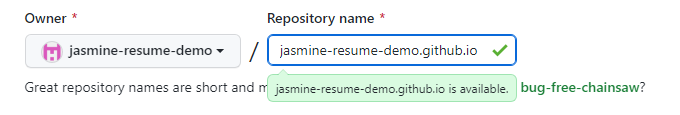

# How to Host a Resume on Github Pages using VSCode and Jekyll on Windows

## Purpose
This guide will teach you how to host a resume on GitHub Pages using Visual Studio Code and Jekyll on Windows.

Additionally, this guide will teach you some of Andrew Etter's key principals in technical communication, namely:      

1. Use a lightweight markup language
2. Format a document with a static site generator
3. Share/host documents on a distributed version control system

## Prerequisites
- A [GitHub](https://github.com/) account 
    - Microsoft provides a great tutorial on [creating a GitHub account](https://learn.microsoft.com/en-us/visualstudio/version-control/git-create-github-account?view=vs-2022).
- A resume in Markdown 
    - You can find a Markdown tutorial in the [More Resources](https://jasmine-tabuzo.github.io/README.html#more-resources) section of this guide.
- [Visual Studio Code](https://code.visualstudio.com/)
- Jekyll installation prerequisites (Ruby version 2.5.0 or higher, RubyGems, GCC and Make)
    - If you do not already have these installed, you can follow the first two steps of this [Jekyll guide](https://jekyllrb.com/docs/installation/windows/). 
    - I recommend using the `Ruby+Devkit 3.1.3-1 (x64)` version. This version was used to create the resume demo. Other versions may still be compatible, but I recommend using this version to avoid potential implications that are not covered in this guide. 
- A computer that runs Windows OS

## Instructions

> Throughout this section, I will refer to Andrew Etter's book, *Modern Technical Writing: An Introduction to Software Documentation* to describe some key principals in technical communication. 
> 
> A link to Etter's book can be found in the [More Resources](https://jasmine-tabuzo.github.io/README.html#more-resources) section of this guide.

### 1. Create your GitHub repository

> *Etter's Key Principal: Share/host documents on a distributed version control system* 
> 
> We will be using GitHub in this guide because it is a distributed version control system (DVCS). As Etter states, a DVCS has better performance, allows for offline work, and is great for doing concurrent work on the same files. Thus, by using GitHub, you can make changes to your resume while offline and then push those changes to your repository when you're ready to update your hosted resume. Additionally, you can work on your resume from multiple computers by editing the file directly on GitHub! This is a great feature to have if you need to quickly edit your resume before a potential employer sees it!

1. Login to your account on GitHub 
2. Select the **+** dropdown in the navigation bar    
    
2. Select **New Repository**     
    
3. Set the repository name to `<your GitHub username>.github.io`    
    

### 2. Create a Jekyll Site

> *Etter's Key Principle: Format a document with a static site generator*    
> 
>  Jekyll is a static site generator. Etter states that static sites have "speed, simplicity, portability, and security."  

1. Type `Command Prompt` into the Windows searchbar.
2. Hit **Enter** 
    - A new terminal should appear. 
3. Install Jekyll by entering `gem install jekyll bundler` into the terminal 
    - To check if Jekyll has been installed, enter `jekyll -v` into the terminal. After entering that command, you should see `jekyll <some version number>` (for example, `jekyll 4.3.2`).
4. Create a new Jekyll site by following [steps 2-6](https://jekyllrb.com/docs/) 

### 3. Add your resume to the site

> *Etter's Key Principle: Use a lightweight markup language*
>
> As the prerequisites have stated, your resume must be in markdown format. According to Etter, Markdown is the most widely used lightweight markup language in the world. Lightweight markup makes it easier to build websites using human-readable content. Additionally, Etter mentions the separation between content and style. By using markdown, you can easily apply various themes and styles to your content!

1. Open the folder of your project 
2. Add your resume markdown file to the folder 
3. Open the folder in Visual Studio Code
4.  Open your resume file
5.  Add the following lines of code to the top of your resume file, including the dashed lines:    
```
---
layout: home
title: Resume
---
```
6.  **Save** the file

### 4. Add the Jekyll theme

> *Etter's Key Principle: Format a document with a static site generator*   
> 
>  In addition to using a static site generator, Etter recommends to take some time to customize the theme. Etter states to "focus on navigation and approachability." This is your chance to differentiate your resume from other ones out there!  

1. Open the `_config.yml` file
2. Add this line to the end of the file `remote_theme: pmarsceill/just-the-docs` 
3. Save the `_config.yml` file
4. Open the `Gemfile` file
5. Change `gem "minima"` to `gem "just-the-docs"`
6. Save the `Gemfile` file

### 5. Upload your Jekyll site to GitHub

1.  Go to your repository on GitHub
2.  Select **Add file** 
3.  Select **Upload files**
4.  Drag your Jekyll site folder to your repository 
5.  Commit the changes 
6.  Wait 10 minutes for the page to build. 
7.  Navigate to `[your GitHub username].github.io` in your browser. 

Congratulations! You have successfully hosted your resume on GitHub Pages using Jekyll and Visual Studio Code. 

You should now have a hosted resume that looks like the one shown below: 


### More Resources

- Andrew Etter's [Modern Technical Writing: An Introduction to Software Documentation](https://www.amazon.ca/Modern-Technical-Writing-Introduction-Documentation-ebook/dp/B01A2QL9SS)
- [Markdown Tutorial](https://www.markdowntutorial.com/)
- 

## Authors and Acknowledgements

- Template: [Just the Docs](https://github.com/just-the-docs/just-the-docs)
- Group 16: 
    - Sahilpreet Sidhu 
    - Eric Shu 
    - Kha Pham 


## FAQs

- Where can I find more Jekyll themes? 
    - You can find more Jekyll themes [here](https://jekyllrb.com/docs/themes/).

- Can I add pictures to my site?
    - Yes, you can add pictures to your site. To learn how to add pictures using markdown, follow this [lesson](https://www.markdowntutorial.com/lesson/4/).

- How do I work on my hosted resume offline? 
